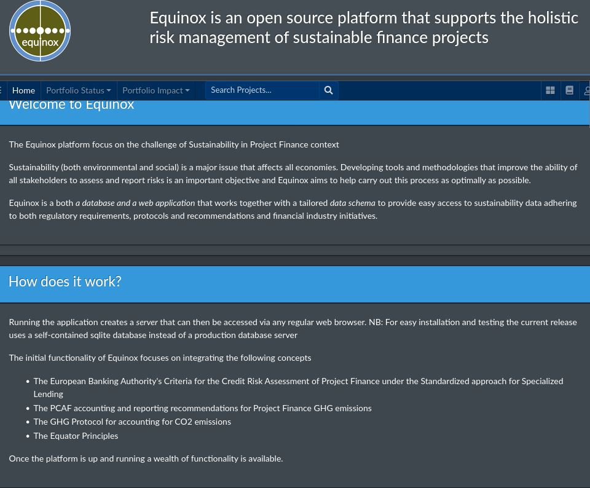
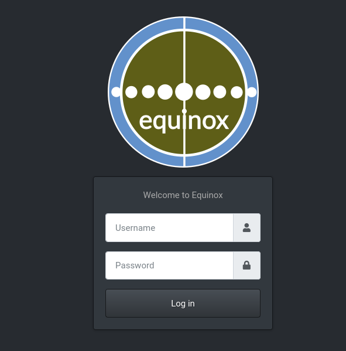

# Equinox Overview
 Equinox is an open source platform for sustainable portfolio management. It supports holistic risk management and reporting of sustainable finance projects in accordance with evolving industry standards.

## The Challenge of Sustainable Finance
Sustainability (understood both in environmental and social terms) is a seriously challenging and for the foreseable future persistent issue that affects all economies irrespective of state of development. Tools and methodologies that improve the ability of all stakeholders to assess and report risks are thus an important objective.

## What exactly is Equinox?
Equinox is a *database and a web application frontend* that works together with tailored data schemas to provide a flexible and powerful Sustainable Finance platform adhering to many regulatory and ESG initiatives and recommendations. 

Running an equinox *instance* creates a local *server* that can then be accessed via any regular web browser. With some additional installation steps an instance can be also be made available online (publicly or via registration). 

NB: For easy installation and testing the current release uses an sqlite database instead of a production database.

## Functionality

The initial functionality of Equinox focuses on integrating the following concepts:

* Green Public Procurement (GPP) portfolio management
* GHG Accounting Protocol for Projects
* The PCAF coalition's approach to accounting and reporting **mortgage portfolio** GHG emissions
* The PCAF coalition's approach to accounting and reporting **project finance** GHG emissions
* Equator Principles for Project Finance
* The European Banking Authority's Criteria for Credit Risk Assessment of Project Finance under the Standardized approach for Specialized Lending

## Find out more:
- For [User Documentation](https://www.openriskmanagement.com/equinox/)
- For [Technical Documentation](https://equinox-server.readthedocs.io/en/latest/)
- 💬 [Discussion at the Open Risk Commons](https://www.openriskcommons.org/c/equinox/27)
- For broader sustainable finance knowledge base, consult the [Open Risk Manual](https://www.openriskmanual.org/wiki/Category:Sustainable_Finance)
- 🌱 For training, head to the [Open Risk Academy](https://www.openriskacademy.com/)
- For a [live demo](https://www.equinoxpoint.org/)

## Screenshots

The landing page of a working equinox instance:

To get anything done we need to login! (admin/admin would be the credentials in a local demo instance)

Once you login successfully you'd be greeted by the admin area

The admin is our main workbench

## Credits

* The Python and Django ecosystems and the many powerful software components (Geodjango, Jazzmin, ... full list coming) 
* The GHG Protocol
* The Partnership for Carbon Accounting Financials  
* The European Banking Authority
* The EU Open Data Portal and the EU Publications Office 
* The Equator Principles Alliance